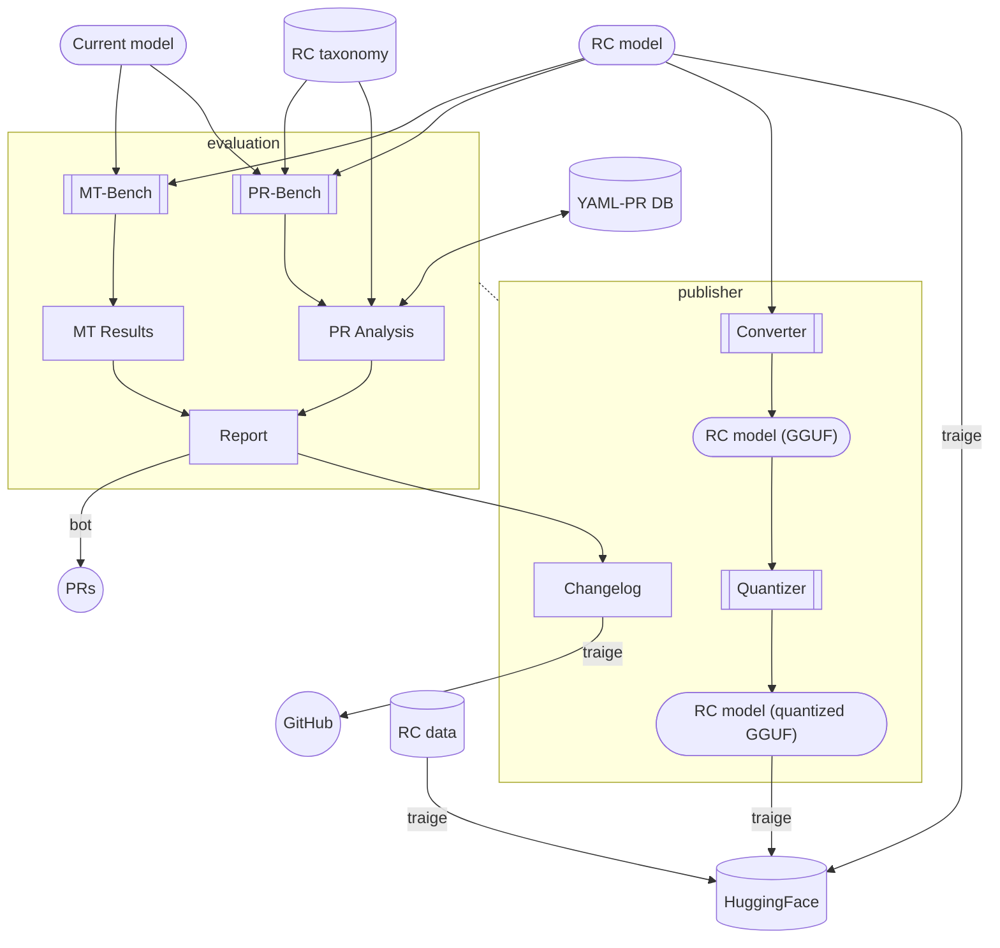

```mermaid
flowchart TB
    current_model([Current model])
    current_model-->mt_bench
    current_model-->pr_bench

    rc_model([RC model])
    rc_model-->mt_bench
    rc_model-->pr_bench
    rc_model-->converter
    rc_model-->|traige|hf

    rc_taxonomy[(RC taxonomy)]
    rc_taxonomy-->pr_bench
    rc_taxonomy-->pr_analysis

    rc_data[(RC data)]
    rc_data-->|traige|hf

    db[(YAML-PR DB)]
    db<-->pr_analysis

    subgraph evaluation
        mt_bench[[MT-Bench]]
        pr_bench[[PR-Bench]]
        
        mt_results[MT Results]
        pr_analysis[PR Analysis]
        report[Report]

        
        mt_bench-->mt_results
        pr_bench-->pr_analysis
        
        mt_results-->report
        pr_analysis-->report
    end

    prs((PRs))

    report-->|bot|prs

    subgraph publisher
        converter[[Converter]]
        rc_model_gguf(["RC model (GGUF)"])
        quantizer[[Quantizer]]
        rc_model_q_gguf(["RC model (quantized GGUF)"])
        changelog[Changelog]

        
        converter-->rc_model_gguf
        rc_model_gguf-->quantizer
        quantizer-->rc_model_q_gguf
        report-->changelog
    end

    evaluation-.-publisher

    gh((GitHub))
    changelog-->|traige|gh

    hf[(HuggingFace)]
    rc_model_q_gguf-->|traige|hf
```